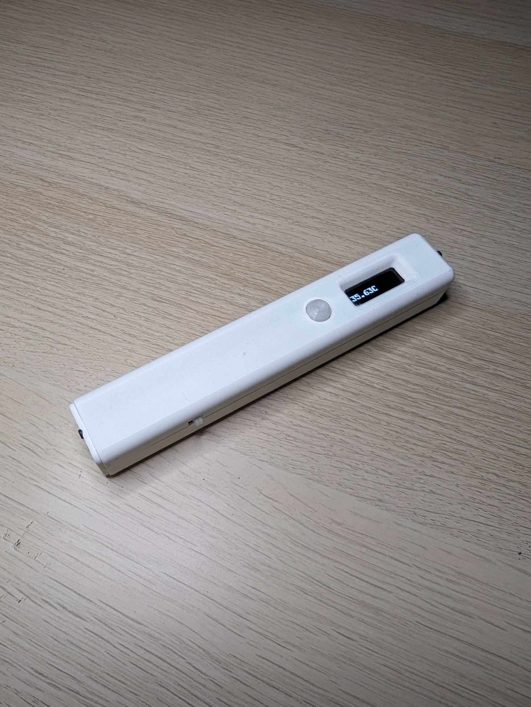

# Infrared temprature thing

Portable! Battery powered! Rechargable!

Programable with a generic FTDI module. It even has a cutout.

## Smol issue

Will not compile unless `.pio\libdeps\uno\ssd1306\src\ssd1306_hal\arduino\platform.cpp` is fixed by removing usages of `Wire1`. Just use `Wire` in their place. There was one more occurence.

## TODO

We might need to configure emissivity of the sensor. It defaults to 1.0.
